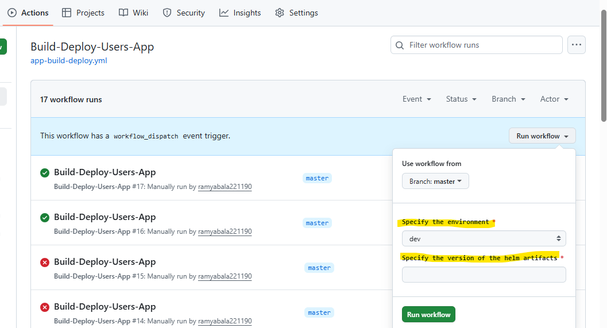
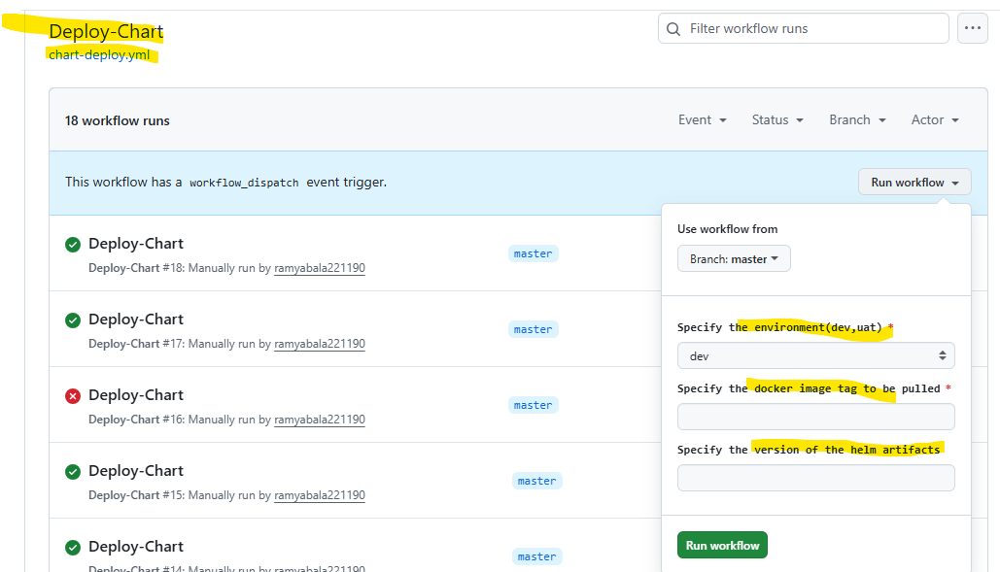

C:\Users\User\angular\microfrontends\module-federation-updated>ng new usersApp


C:\Users\User\angular\microfrontends\module-federation-updated\usersApp>ng add @angular-architects/module-federation@"^16.0.4" --port 5008
ℹ Using package manager: npm
✔ Package information loaded.

The package @angular-architects/module-federation@^16.0.4 will be installed and executed.
Would you like to proceed? Yes
✔ Packages successfully installed.
? Project name (press enter for default project) usersApp
CREATE webpack.config.js (1588 bytes)
CREATE webpack.prod.config.js (46 bytes)
CREATE src/bootstrap.ts (214 bytes)
UPDATE tsconfig.json (823 bytes)
UPDATE tsconfig.app.json (185 bytes)
UPDATE angular.json (2650 bytes)
UPDATE package.json (1230 bytes)
UPDATE src/main.ts (58 bytes)
✔ Packages installed successfully.

C:\Users\User\angular\microfrontends\module-federation-updated\usersApp>

Details on routing given in shell-app repo. Please check that.

# How does the deployment work ?

The chart version should change only when there are changes in the files/folders in the
charts/angular-users-app-module-federation. Otherwise we give the same chart version if no
change in these files.

But if only the app image changes, you can reuse the same chart version and just override values.

Best practice: chart version = chart template changes, image tag = app changes.

So we need two workflows that can run independently but also depend on each other.

1. They need to depend when we need to build and push docker image for app followed by helm package + upgrade.
2. Independence is required, when we just need to do helm upgrade using the existing docker image tag and
chart version.

Point 1. is required for dev deployment, when we build+push docker image for the app. Next we also package the chart files
into a .tgz artifact, push it to Dockerhub and then do the Helm upgrade to install/upgrade the chart release.
We will provide the chart version alone as user input. Docker image tag will be the github runner id.

Point 2. is required for higher environments i.e uat in this example. We just need to do the helm upgrade by passing the chart version
and docker image tag used for dev deployment. Here we need to pass the docker image tag and github runner id as input.

So for point 1. we have the app-build-deploy.yml and for point 2. we have the chart-deploy.yml.

Before we get into the details of each file, lets understand how we are connecting the workflows for point 1.

In app-build-deploy.yml, we have defined 2 jobs: build-and-deploy and the helm-upgrade.
By default, jobs in the workflow file execute in parallel.
To ensure that the helm-upgrade job executes after the build-deploy job, we have used the "needs:" fields as below.

```
  helm-upgrade:
    needs: build-and-deploy  # execute in sequence. The build-and-deploy job needs to complete first
    permissions:  # these are required for azure login
         id-token: write # required for OIDC 
         contents: read # required for actions/checkout
    uses: ./.github/workflows/chart-deploy.yml  # path to the workflow to be executed
    with:  # input parameters to be passed
      image_tag: ${{ github.run_id }} 
      chart_version: ${{ github.event.inputs.version }}
      environment: ${{ github.event.inputs.environment }}
    secrets: inherit  # github secrets can be inherited from the current workflow. v.imp for secrets to work in the called workflow

```

For azure login in the child workflow, we required the id-token and contents permissions to be given to the child workflow.
So those permissions need to be given from the parent workflow.
The "uses:" field provides the path to the child workflow
The "with:" field provides the parameters to be passed as input to the child workflow. We are passing the docker image tag,
helm chart version and the environment.
We also need to tell that the child workflow can use the secrets in the github repo. So we have used "inherit" as the value.

Lets first check the build-and-deploy job in the app-build-deploy.yml.

Below is a screenshot of we trigger it from the github repo--->Actions tab.
We just provide the helm chart version to be used. It should be in semver format eg:1.1.0



We are using Dockerhub to store docker images of the app and also Helm chart artifacts.

To login to Dockerhub to build and push docker images of the app, we use the in-built github action.
We authenticate using dockerhub username and password.

```
 - name: Login to DockerHub
          # executed only for dev
            if: ${{ github.event.inputs.environment == 'dev' }}
            uses: docker/login-action@v3
            with:
              username: ${{vars.DOCKERHUB_USERNAME}}
              password: ${{secrets.DOCKERHUB_PASSWORD}}
              # added the dockerhub username as repo variable and password as repo secret


          - name: Build Docker image for Users app
          # executed only for dev
            if: ${{ github.event.inputs.environment == 'dev' }}
            uses: docker/build-push-action@v5
            with:
              push: true  # so that image is pushed to Dockerhub as well
              context: .   # this ensures the paths in the Dockerfile work as expected
              file: ./docker/Dockerfile  # this ensures the Dockerfile is located in the correct folder
              tags: ${{vars.DOCKERHUB_USERNAME}}/${{vars.APP_NAME}}:${{env.TAG}}

```

Next we are calling the helm-upgrade job,where the child workflow in the chart-deploy.yml is triggered.
In the child workflow, we just have 1 chart-deploy job.

We have 2 trigger events: workflow_call and workflow_dispatch. 
We require workflow_call because this workflow is called from within the app-build-deploy.yml.
Observe the "inputs:" field, under which we have specified the "required:" and "type:" fields of
the input data we are going to receive from the parent app-build-deploy.yml. The "type:" needs to match the data type of the data being received from the parent workflow, otherwise the child workflow doesnt
get called.

```
on: 
  workflow_call: # this is required when called in another workflow
    inputs:
      image_tag:
        required: true
        type: string
      chart_version:
        required: false
        type: string
      environment:
        required: true
        type: string

```

We have also specified workflow_dispatch as a trigger, because we will invoke the chart-deploy.yml 
manually for higher environment deployments, passing the environment,docker image tag and the helm chart version as user inputs. 

```
 workflow_dispatch: # manual trigger from Github
   inputs:
     environment:
        type: choice
        description: "Specify the environment(dev,uat)"
        options:
          - dev
          - uat
        required: true
        default: 'dev'
      
     tag:
      description: "Specify the docker image tag to be pulled"
      required: true
     
     version:
       description: "Specify the version of the helm artifacts"
       required: false

```

Below is a screenshot of the same.



In the chart-deploy.yml, we have given permissions here as well at job level because these are required
when the workflow is triggered manually. When triggered from parent workflow, the permissions are already
provided from the parent via the same "permissions:" field.

```
 permissions: 
         id-token: write # required for OIDC 
         contents: read # required for actions/checkout
```

Since in the chart-deploy.yml, the values of environment, docker image tag and chart version could either
come from parent workflow or from manual user input, it is important to take the appropriate value and set it in environment variables: TAG,VERSION and ENV so that it can be used throughout the job, wherever it is
required.

${{ github.event.inputs.tag }} ,  ${{ github.event.inputs.version }}  or ${{ github.event.inputs.environment }} stores the data received via manual user input.

${{ inputs.image_tag }},${{ inputs.chart_version }} and ${{ inputs.environment }} stores the data
received as inputs from parent workflow.

Based on what is available, we set the value of environment variables TAG,VERSION and ENV.

```
 - name: Set Docker Image tag 
            run: | 
              if [ -n "$INPUT_TAG" ]; then 
                echo "TAG=$INPUT_TAG" >> $GITHUB_ENV 
              else 
                echo "TAG=$WORKFLOW_IMAGE_TAG" >> $GITHUB_ENV 
              fi 
            env: 
              INPUT_TAG: ${{ github.event.inputs.tag }} 
              WORKFLOW_IMAGE_TAG: ${{ inputs.image_tag }}

          - name: Set Helm Chart version
            run : |
                  if [ -n "$INPUT_VERSION" ]; then
                     echo "VERSION=$INPUT_VERSION" >> $GITHUB_ENV
                  else
                     echo "VERSION=$WORKFLOW_CHART_VERSION" >> $GITHUB_ENV
                  fi
            env: 
              INPUT_VERSION: ${{ github.event.inputs.version }} 
              WORKFLOW_CHART_VERSION: ${{ inputs.chart_version }}

          
          - name: Set environment
            run : |
                if [ -n "$INPUT_ENV" ]; then
                     echo "ENV=$INPUT_ENV" >> $GITHUB_ENV
                else
                     echo "ENV=$WORKFLOW_ENV" >> $GITHUB_ENV
                fi
            env: 
              INPUT_ENV: ${{ github.event.inputs.environment }} 
              WORKFLOW_ENV: ${{ inputs.environment }}
             
```
To deploy anything to AKS cluster, we need to first login to Azure, provide the cluster name and resource group and also provide the credentials. These are all acheived in the below 3 steps.
Client id ,tenant id and subscription Id can be got from the Azure portal. Steps in the shell app repo.

```
 - name: Azure Login
            uses: azure/login@v2.3.0
            with:
               client-id: ${{ secrets.AZURE_APP_CLIENT_ID }}
               tenant-id: ${{ secrets.AZURE_TENANT_ID }}
               subscription-id: ${{ secrets.AZURE_SUBSCRIPTION_ID }}
          
          - name: Set AKS context 
            uses: azure/aks-set-context@v3 
            with: 
              resource-group : ${{vars.AZURE_RESOURCE_GROUP}} 
              cluster-name: ${{vars.AZURE_CLUSTER_NAME}}

          - name: Get AKS credentials (admin bypass) 
            run: | 
              az aks get-credentials --resource-group ${{vars.AZURE_RESOURCE_GROUP}}  --name ${{vars.AZURE_CLUSTER_NAME}} --admin --overwrite-existing

```

Moving to Helm package + upgrade step.

```
  - name: Helm package and push to DockerHub
            if: ${{ env.ENV == 'dev' }}
            run : |
               helm package --version=$VERSION ./charts/${{vars.HELM_CHART_NAME}}/ --destination ./artifacts
               helm push ./artifacts/${{vars.HELM_CHART_NAME}}-$VERSION.tgz oci://registry-1.docker.io/${{vars.DOCKERHUB_USERNAME}}/
          
```

Please observe that the packaging + pushing step is only done for dev environment. The idea is that once the chart artifacts are packaged into a .tgz file, we reuse the same across all environments.
But in order to reuse across uat and higher environments, we need to store them somewhere. Thats where Dockerhub comes in. So we push the .tgz file to Dockerhub using "helm push" and then pull the same during "helm upgrade".

To push charts to Dockerhub, we need to login using the same dockerhub username and a personal access token having read and write access. We created this token by logging into Dockerhub, going to Account Settings ---> Personal Access Token ---> Create Token.
Dockerhub password will not work here. you need to have the access token

```
  - name: Login to Docker Hub for Helm 
            env: 
              DOCKERHUB_REGISTRY_USERNAME: ${{ vars.DOCKERHUB_USERNAME }} 
              DOCKERHUB_REGISTRY_PA_TOKEN: ${{ secrets.DOCKERHUB_PA_TOKEN }} 
            run: | 
              helm registry login registry-1.docker.io --username "$DOCKERHUB_REGISTRY_USERNAME" --password "$DOCKERHUB_REGISTRY_PA_TOKEN"
```

Only after this completes successfully, we go ahead with packaging the chart artifacts and pushing them to
Dockerhub. 

A repo is nothing but the image name and the tag is different versions of the image.
So the chart name is the repo/image name and the chart version will be different tags for the image.

```
 - name: Helm package and push to DockerHub
            if: ${{ github.event.inputs.environment == 'dev' }}
            run : |
               helm package --version=${{ github.event.inputs.version }} ./charts/${{vars.HELM_CHART_NAME}}/ --destination ./artifacts
               helm push ./artifacts/${{vars.HELM_CHART_NAME}}-${{ github.event.inputs.version }}.tgz oci://registry-1.docker.io/${{vars.DOCKERHUB_USERNAME}}/

```

Lets understand how these 2 commands work.

```
 helm package --version=${{ github.event.inputs.version }} ./charts/${{vars.HELM_CHART_NAME}}/ --destination ./artifacts

```

`helm package` is only for creating a **versioned `.tgz` artifact** of your chart.  
That’s useful when you want to:
  - Publish charts to a Helm repository.  
  - Promote the same chart artifact across environments (dev → staging → prod).  

We have passed the chart artifact version to be used to the --version flag. This version will function as image tag when the artifact is pushed to Dockerhub.
./charts/${{vars.HELM_CHART_NAME}}/ is the directory containing the Chart.yml,values.yml and the templates folder.
The --destination flag contains the folder name where the .tgz artifacts need to be stored.
So we will be storing the .tgz files in the artifacts folder in the root of the project.

Moving to the next command.

```
 helm push ./artifacts/${{vars.HELM_CHART_NAME}}-${{ github.event.inputs.version }}.tgz oci://registry-1.docker.io/${{vars.DOCKERHUB_USERNAME}}/
```
To the "helm push" command, we are passing the path of the .tgz file to be pushed to Dockerhub i.e the .tgz file stored in artifacts folder.
So the .tgz file will have the format: <chart-name>-<chart-version>.tgz.
So ./artifacts/${{vars.HELM_CHART_NAME}}-${{ github.event.inputs.version }}.tgz is the path to the artifact created using "helm package"
We are going to push it into oci://registry-1.docker.io/${{vars.DOCKERHUB_USERNAME}}/
Observe that we have provided only the dockerhub username.
Which repo in dockerhub will these artifacts be stored ?

The repo name will be the chart name, where the artifact will be stored as an image. It will be created automatically if it does not exist.
The artifact version will be image tag.

The above 2 commands will be executed only for dev environment. 

Lets get to the next step, where we do the "helm upgrade". This will execute for all environments.

```
 - name: Helm Upgrade
            run: |
               helm upgrade ${{vars.APP_NAME}}-release oci://registry-1.docker.io/${{vars.DOCKERHUB_USERNAME}}/${{vars.HELM_CHART_NAME}} \
               --version ${{ github.event.inputs.version }} \
               --install --debug \
               --set pod.imageName=${{vars.DOCKERHUB_USERNAME}}/${{vars.APP_NAME}}:${{env.TAG}}  \
               --set environment=${{ github.event.inputs.environment }}


```

helm upgrade creates a new release or updates an existing release with a new version of your chart or new values.

helm upgrade <release-name> <chart-path-or-tgz> [flags]

The release-name could be anything but it should remain consistent. So i given the app name as the release name i.e users-app-release
Next we provide the path to the folder where the Chart.yml, values.yml and templates folder lives OR we provide the path to the .tgz
file OR we provide the details of the registry from where the image needs to be pulled.

So we have given : oci://registry-1.docker.io/${{vars.DOCKERHUB_USERNAME}}/${{vars.HELM_CHART_NAME}}
We have provided the dockerhub username and the helm chart name which is nothing but the repo in dockerhub where the artifact is stored
as an image.
Its possible that we have multiple tags/versions of the image.
So we have passed  --version ${{ github.event.inputs.version }}  to pull the correct artifact.
We are updating the fields in values.yaml using --set without providing the path to values.yaml so that it automatically takes it
from the remote artifact and not from the local file in the worflow runner.
The --values values.yaml or -f values.yaml flag points to a local file in your workflow runner, not inside the registry.So we have not passed
these flags.


## Should the release-name be unique or same ?

1. If you deploy to separate namespaces (dev, uat, prod) or separate clusters, you can keep the release name consistent.

2. If you deploy into the same namespace but want multiple instances of the chart, you must use different release names.

Since we are deploying into seperate namespaces, we are using the same release name for a project across all environments.
Different projects have different release names but it remains same across the 3 environments.

## Why the --install flag ?

Purpose: If the release doesn’t already exist, Helm will install it instead of failing.

Without --install, helm upgrade only works if the release already exists.

Typical use case: CI/CD pipelines, where you don’t want to worry about whether the release is already present — you just want Helm to either upgrade it if it exists, or install it if it doesn’t.

## Why the --debug flag ?

Purpose: Enables verbose output and debugging information.

Shows detailed logs about what Helm is doing (template rendering, API calls, registry interactions).

Useful when troubleshooting chart issues, registry pushes/pulls, or Kubernetes API errors.


# Local Docker Desktop Development

Now lets understand how this differs from local Docker Desktop development.
Below are the commands in the package.json for local development. In local too, we maintain 3 environments: dev, uat and prod.
For dev alone, we execute "helm pack" followed by "helm-upgrade-dev". For the rest its just "helm-upgrade-uat" or "helm-upgrade-prod".

```
    "helm-pack":"helm package --version=1.0.1 ./charts/angular-users-app-module-federation/ --destination ./artifacts",
    
    "helm-upgrade-dev":"helm upgrade users-app-release ./charts/angular-users-app-module-federation/ --install --debug --values ./charts/angular-users-app-module-federation/values.yaml --set pod.imageName=users-app:7 --set environment=dev",
    
    "helm-upgrade-uat":"helm upgrade users-app-release ./artifacts/angular-users-app-module-federation-1.0.1.tgz --install --debug --values ./charts/angular-users-app-module-federation/values.yaml --set pod.imageName=users-app:7 --set environment=uat",
    
    "helm-upgrade-prod":"helm upgrade users-app-release ./artifacts/angular-users-app-module-federation-1.0.1.tgz --install --debug --values ./charts/angular-users-app-module-federation/values.yaml --set pod.imageName=users-app:7 --set environment=prod"
```

Lets start with "helm-pack". The structure is same. We are passing the new/existing chart version: 1.0.1. Next we are passing the path to
the folder containing the Chart.yaml,values.yaml and the templates folder. Finally the --destination flag specifies that the .tgz file
must be stored in the artifacts folder in the root of the project.

```
 "helm-pack":"helm package --version=1.0.1 ./charts/angular-users-app-module-federation/ --destination ./artifacts",
```

Moving to "helm-upgrade-dev". Again structure is same with a small difference.

```
 "helm-upgrade-dev":"helm upgrade users-app-release ./charts/angular-users-app-module-federation/ --install --debug --values ./charts/angular-users-app-module-federation/values.yaml --set pod.imageName=users-app:7 --set environment=dev",
```

First argument is the release name: users-app-release
Next is the path to the folder containing the Chart.yaml,values.yaml and the templates folder. We have passed the path so that you
can do any changes in the folder and just execute the "helm-upgrade-dev" to see the changes. 
we are also passing the path to the values.yaml using the --values flag. This was something we omitted in the Github actions.
--set flag updates the parameters in the values.yaml

Now the structure of "helm-upgrade-uat" or "helm-upgrade-prod" is the same except for 1 difference. In the 2nd argument, instead of
passing the path to the folder containing the Chart.yaml,values.yaml and the templates folder, we are passing the path to the .tgz file
stored in the artifacts folder. The assumption is that you have tested properly in dev environment and we can safely pass the .tgz file
to the "helm upgrade" command.

For local development, no need to push the .tgz file into any registry.

The flow remains the same:
1. For dev, build docker image stored in docker desktop.
2. Create namespace and update context.
3. For dev, package the chart into a .tgz file in the artifacts folder.
4. Do the helm upgrade, using new/existing chart version, update the docker image tag to be used and also any updates in the values.yaml.